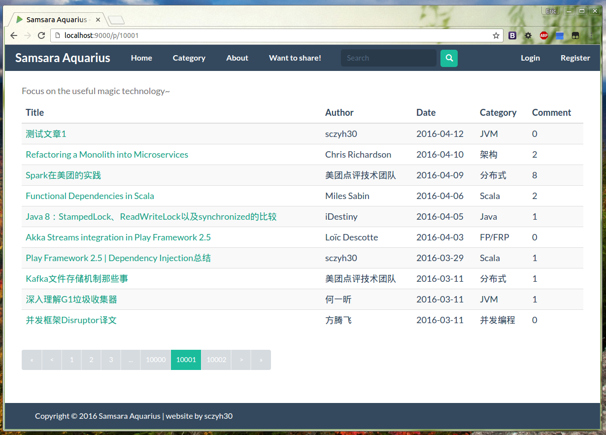

# Samsara Aquarius

[](https://travis-ci.org/sczyh30/samsara-aquarius)

**Samsara Aquarius** is a technology sharing web application written in **Scala 2.11.8** and based on Play Framework 2.5, Slick 3 and Akka.



## Build Dist Version

```bash
sbt dist
```

Notice: In production environment, please open the `play.http.filters` option to ensure security.
In addition, the Samsara Aquarius uses *Geetest Captcha* as the captcha library, so if you want to work with it, you need to create a `captcha.conf` file at `conf` directory and configure.

## Current Task

- [ ] Review: Ensure security (current version is **not** verified)
- [ ] More functional style
- [ ] Microservice architecture
- [ ] Message-based architecture