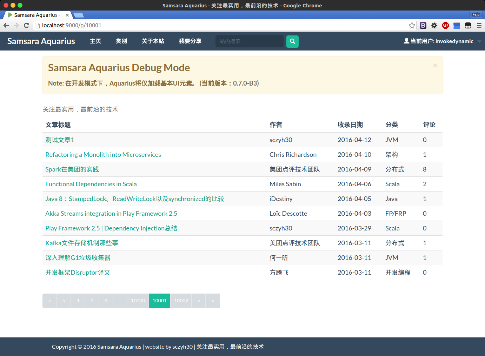

# Samsara Aquarius

[](https://travis-ci.org/sczyh30/samsara-aquarius)

Samsara Aquarius是一个由 **Scala** 编写，基于 Play Framework 2.5, Slick 3 以及 Akka 的技术分享社区Web应用。

当前版本: **0.8.0**



## 构建生产环境版本

```bash
sbt dist
```

注意: 在生产环境中，请开启 `play.http.filters` 选项以保证安全，同时需要去掉前端的所有外部依赖。另外，Aquarius使用了 *Geetest Captcha* 作为验证码验证库，因此如果要使其正常工作，你需自行在`conf`目录中创建`captcha.conf`文件并配置。

## Current Task

- [ ] Review: Ensure security(current version is **not** verified)
- [ ] More functional style
- [ ] Microservice architecture
- [ ] Message-based architecture